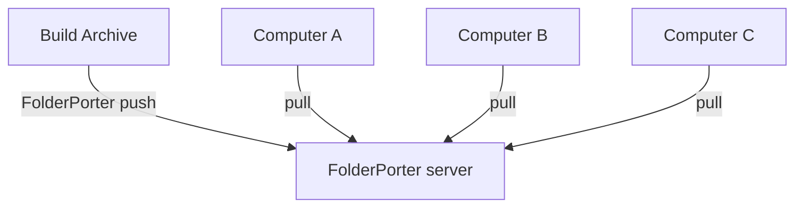

[English](./README.md)|[简体中文](./README-zh.md)

- 文件夹搬运工在多台电脑之间同步文件夹，差量传输数据。
- 如果当前系统为Linux，文件夹和文件的权限设置为775(rwxrwxr-x)
- 运行环境 .net 8
- 连接方式: TCP

[TOC]
- [架构支持](#架构支持)
- [Windows 安装](#windows-安装)
  - [Windows 添加指令到 cmd](#windows-添加指令到-cmd)
- [Linux 安装](#linux-安装)
  - [环境配置](#环境配置)
  - [拷贝文件](#拷贝文件)
  - [Linux 开启自启服务](#linux-开启自启服务)
  - [Linux 添加指令到 shell](#linux-添加指令到-shell)
- [更新 AppSettings.json](#更新-appsettingsjson)
  - [需要设置的配置](#需要设置的配置)
  - [默认参数，不调也能用](#默认参数不调也能用)
  - [AppSettings.json 模板](#appsettingsjson-模板)
- [Push 使用流程](#push-使用流程)
- [Pull 使用流程](#pull-使用流程)
- [集群部署](#集群部署)

# 架构支持
|                                                                   | Windows x86 | Windows x86-64 | Windows arm64 | Linux arm64 | Linux x86-64 | MacOS x86-64 | MacOS M1 |
| ----------------------------------------------------------------- | ----------- | -------------- | ------------- | ----------- | ------------ | ------------ | -------- |
| [Release](https://github.com/ZhangHuan0407/FolderPorter/releases) | ❌           | ✅              | ❌             | ✅           | ✅            | ❌            | ❌        |
| 源码安装                                                          | ❌           | ✅              | ❓             | ✅           | ✅            | ❓            | ❓        |
- ✅: 是
- ❓: 理论上支持，但没有测试
- ❌: 否

# Windows 安装
- 解压 [下载文件](https://github.com/ZhangHuan0407/FolderPorter/releases)
```
FolderPorter.exe
```
- 也许可以正常运行，也许需要自行安装.net 8

- 然后, [更新 AppSettings.json](#更新-appsettingsjson)

## Windows 添加指令到 cmd
- 修改系统环境变量
- 添加 FolderPorter.exe 所在文件夹


- 打开cmd，输入 FinderPorter
- 启动FinderPorter进程即视为成功

# Linux 安装
## 环境配置
- 首先, [install dotnet 8](https://learn.microsoft.com/zh-cn/dotnet/core/install/linux-ubuntu-install)
```
sudo apt install dotnet-runtime-8.0
```

## 拷贝文件
- 然后, 解压[下载文件](https://github.com/ZhangHuan0407/FolderPorter/releases) 的压缩包，并将它移动到 /lib/FolderPorter
```
cd /var
wget -O /var/FolderPorter.zip download-url-here
unzip FolderPorter.zip
cd /lib
mkdir FolderPorter
mv /var/FolderPorter/* /lib/FolderPorter/
cp /lib/FolderPorter/AppSettingsTemplate.json /lib/FolderPorter/AppSettings.json
chmod +x /lib/FolderPorter
chmod +x /lib/FolderPorter/FolderPorter
chmod +r /lib/FolderPorter/*
ls -al FolderPorter/
# drwxrwxrwx   2 root         root           4096 May 10 14:32 .
# -rwxr-xr-x   1 root         root         123942 May 10 14:32 FolderPorter
# -rw-r--r--   1 root         root            431 May 10 13:19 AppSettings.json
# 其余文件省略
```

- 其次, [更新 AppSettings.json](#更新-appsettingsjson)

## Linux 开启自启服务
- 可选，开机自启 FolderPorter server
- sudo nano /etc/systemd/system/FolderPorter.service
- 加入下列内容
```
[Unit]
Description=FolderPorter server :17979 /lib/FolderPorter
After=network.target

[Service]
WorkingDirectory=/lib/FolderPorter
ExecStart=/lib/FolderPorter/FolderPorter server

# 请注意，此处设置了进程挂掉自动重启进程
Restart=on-failure
RestartSec=120

KillSignal=SIGINT

# 最好不要设置root用户，否则文件创建时所有者是root用户
User=folderporter

[Install]
WantedBy=multi-user.target
```
- 使用systemctl来控制server启动和停用
```
# 开机自启
systemctl enable FolderPorter.service
# 关闭自启
systemctl disable FolderPorter.service
# 查看状态
systemctl status FolderPorter.service
# 启动
systemctl restart FolderPorter.service
# 停止，如果设置了Restart=on-failure，记得先disable再stop
systemctl stop FolderPorter.service
```

## Linux 添加指令到 shell
```
sudo ln -s /lib/FolderPorter/FolderPorter /bin/FolderPorter
```

# 更新 AppSettings.json
## 需要设置的配置
- Password是当前驱动器上运行的应用程序的密码。长度限制: 1000
- LocalFolders列举所有绑定的文件夹，key为文件夹名称
  - RootPath为此文件夹的磁盘路径，Windows 和 Linux 均使用 /，否则可能执行报错
  - CanWrite此文件夹是否接受远程设备的Push(或本地Pull)
  - CanRead此文件夹是否接受远程设备的Pull(或本地Push)
- RemoteDevice列举所有可访问的远程设备，key为远程设备名称
  - IP为远程设备server模式监听的IP+端口
  - DevicePassword为远程设备AppSettings.json的Password

## 默认参数，不调也能用
- MaxWorkerThreadCount线程池的运算线程数量上限
- MaxIOThreadCount线程池的IO线程数量上限
- RemoteBuzyRetrySeconds当远程设备处于繁忙状态，延迟此时间后重试
- ConnectTimeoutSeconds连接超时时间

## AppSettings.json 模板
```
{
  "Password": "c7ce0d8e-4985-4464-9146-0767be889a45",
  "LocalFolders": {
    "RegexGameWebGL": {
      "RootPath": "D:/RegexGame/Builds/WebGL Github/RegexGame",
      "CanWrite": true,
      "CanRead": true
    },
    "TestFolder": {
      "RootPath": "/var/TestFolder",
      "CanWrite": true,
      "CanRead": true
    }
  },
  "RemoteDevice": {
    "raspberry": {
      "IP": "192.168.1.3:17979",
      "DevicePassword": "d0d642fb-b77d-4e32-b77d-2444cd8788c3"
    }
  },

  "MaxWorkerThreadCount": 2,
  "MaxIOThreadCount": 3,

  "RemoteBuzyRetrySeconds": 5,
  "ConnectTimeoutSeconds": 30,

  "ListernPort": 17979
}
```

# Push 使用流程
- 假定 192.168.1.2 需要传递文件到 192.168.1.1

- PC 192.168.1.1 AppSettings.json
```
{
  "Password": "123",
  "LocalFolders": {
    "TestFolder": {
      "RootPath": "/var/TestFolder",
      "CanRead": true,
      "CanWrite": true
    }
  }
  "ListernPort": 17979,
  ...
}
```

- PC 192.168.1.2 AppSettings.json
```
{
  "LocalFolders": {
    "TestFolder": {
      "RootPath": "d:/TestFolder",
      "CanRead": true,
      "CanWrite": true
    }
  }
  "RemoteDevice": {
    "PC_1": {
      "IP": "192.168.1.1:17979",
      "DevicePassword": "123"
    }
  },
  ...
}
```

- PC 192.168.1.1
```
FolderPorter server
```

- PC 192.168.1.2
```
FolderPorter push@PC_1:TestFolder
```

- 此时，192.168.1.2 会将它的 d:/TestFolder 文件夹推送到 192.168.1.1 /var/TestFolder 文件夹
- 192.168.1.1 会先写入差异的部分，再移除多出的文件

# Pull 使用流程
- 使用[Push 使用流程](#Push 使用流程)中的配置，使用下列指令即可将文件的同步方向反转
- PC 192.168.1.2
```
FolderPorter pull@PC_1:TestFolder
```
- 此时，192.168.1.1 会将它的 /var/TestFolder 文件夹推送到 192.168.1.2 d:/TestFolder 文件夹
- 192.168.1.2 会先写入差异的部分，再移除多出的文件

- 如果存在一般工件传递方向，比如打包机一般只产出不需要回读
- 可以修改此打包机的配置, CanWrite: false, 让写入总是不成功

# 集群部署


- 为了避免多线程操作文件报错
- 当前 Computer A B C 无法并行作业，会自动排队等待