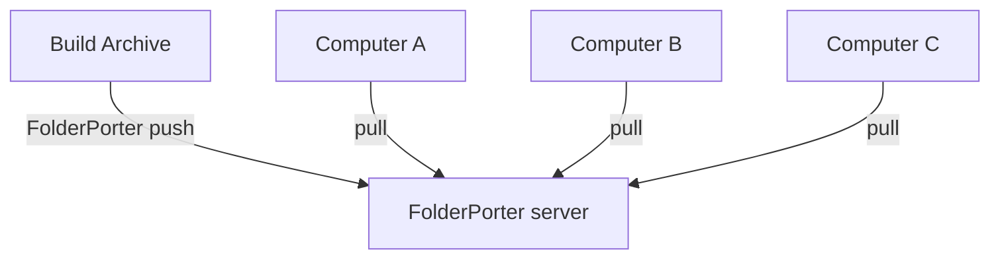

[English](./README.md)|[简体中文](./README-zh.md)

- Folder movers synchronize folders between multiple computers, transferring data differentially.
- If the current system is Linux, set the folder and file permissions to 775 (rwxrwxr-x)
- Runtime environment: .net 8
- Connection method: TCP

# Design Intent
- Initially, I used the scp -r command to synchronize folders, but encountered some problems...
- scp transfers everything in full; it transmits one data packet at a time. In a WiFi environment with a maximum speed of 2 mb/s, scp surprisingly had speeds below 100 kb/s, similar to Baidu Cloud...
- At the same time, scp is based on ssh, and if both devices are Windows, it can't be used without proper setup.
- Copying a file via Windows Remote Desktop often leads to disconnections :(
- In frustration, I created software for file slicing, checksum validation, and differential transmission.
- VersionControl was merely a byproduct; version control was not the main intention.
- Since I expected to archive content after pushing it to a specific folder, I modified the folder storage structure and added version control.
- Due to only having 4 days to develop this software, **the source code is not complex, and the functionality is not powerful**; please use git or svn for version control.
- The core of this thing is:1. Slicing and batch transfer to avoid waiting for each data packet in high
-latency scenarios (transfer 8 files at once, or accumulate over 100mb).2. Implemented differential transmission (1mb per slice, calculating crc32 and comparing); when there are few file differences, it transfers fewer files than scp.3. Optionally waste remote server disk space by adding historical versions.
- In a 2 mb/s WiFi environment with 100 ms latency, scp transmits at 100 kb/s, while FolderPorter transmits at 1.1 mb/s.

[TOC]
- [Design Intent](#design-intent)
- [Support](#support)
  - [](#)
- [版本控制软件差异](#版本控制软件差异)
- [Windows Install](#windows-install)
  - [Windows Edit OS Path](#windows-edit-os-path)
- [Linux Install](#linux-install)
  - [Environment](#environment)
  - [Copy App Files](#copy-app-files)
  - [Add Linux Service](#add-linux-service)
  - [Linux Add Soft Link](#linux-add-soft-link)
- [update AppSettings.json](#update-appsettingsjson)
  - [Configuration that needs to be set](#configuration-that-needs-to-be-set)
  - [Default parameters, can be used without adjustment.](#default-parameters-can-be-used-without-adjustment)
  - [AppSettings.json Template](#appsettingsjson-template)
- [How to Push](#how-to-push)
- [How to Pull](#how-to-pull)
- [How to List](#how-to-list)
- [Cluster Deployment](#cluster-deployment)
- [Multi-network Segment Switching](#multi-network-segment-switching)
- [Version Control File Tree](#version-control-file-tree)

# Support
|                                                                   | Windows x86 | Windows x86-64 | Windows arm64 | Linux arm64 | Linux x86-64 | MacOS x86-64 | MacOS M1 |
| ----------------------------------------------------------------- | ----------- | -------------- | ------------- | ----------- | ------------ | ------------ | -------- |
| [Release](https://github.com/ZhangHuan0407/FolderPorter/releases) | ❌           | ✅              | ❌             | ✅           | ✅            | ❌            | ❌        |
| Source code installation                                          | ❌           | ✅              | ❓             | ✅           | ✅            | ❓            | ❓        |
- ✅: yes
- ❓: Theory supports it, but it has not been tested.
- ❌: no

##
- A release package has been prepared without a specific target runtime.
- Please note that the contents of this package have not been tested.
- [No.specific.target.during.runtime.not.tested.zip](https://github.com/ZhangHuan0407/FolderPorter/releases/download/v0.1.6/No.specific.target.during.runtime.not.tested.zip)

# 版本控制软件差异
|                                | git         | svn                 | FolderPorter(server enable VersionControl，local disable it)                    | scp               |
| ------------------------------ | ----------- | ------------------- | ------------------------------------------------------------------------------- | ----------------- |
| Local History Files            | Exist       | Do not exist        | Do not exist                                                                    | Do not exist      |
| Control System                 | Distributed | Centralized         | Centralized                                                                     | None              |
| Server History Files           | Compressed  | ~~I don’t know~~    | Uncompressed, only generates hard link files with the latest version            | None              |
| Branch                         | Supported   | Supported           | Not supported                                                                   | Not supported     |
| Large Files                    | Git LFS     | svn:externals       | Used a slicing method for file verification and transmission, directly uploaded | Uploaded directly |
| Compressing Large Repositories | Difficult   | Remove old versions | Remove old versions                                                             | No repository     |
| Transmission Encryption        | Exists      | Exists              | Plain text password, plain text transmission, or AES low strength encryption    | Exists            |

# Windows Install
- unzip [downloaded](https://github.com/ZhangHuan0407/FolderPorter/releases)
```
FolderPorter.exe server
```
- It may run normally, or it may require you to install .net 8 yourself.

- And then, [update AppSettings.json](#update-appsettingsjson)

## Windows Edit OS Path
- Edit OS Path
- Add the folder of your FolderPorter.exe


- Open cmd and enter FinderPorter
- Starting the FinderPorter process is considered a success

# Linux Install
## Environment
- First, [install dotnet 8](https://learn.microsoft.com/zh-cn/dotnet/core/install/linux-ubuntu-install)
```
sudo apt install dotnet-runtime-8.0
```

## Copy App Files
- Second, unzip [downloaded](https://github.com/ZhangHuan0407/FolderPorter/releases) zip file and move it to /lib/FolderPorter
```
cd /var
wget -O /var/FolderPorter.zip download-url-here
unzip FolderPorter.zip -d FolderPorter
cd /lib
mkdir FolderPorter
mv /var/FolderPorter/Linux-*/* /lib/FolderPorter/
cp /lib/FolderPorter/AppSettingsTemplate.json /lib/FolderPorter/AppSettings.json
chmod +x /lib/FolderPorter
chmod +x /lib/FolderPorter/FolderPorter
chmod +r /lib/FolderPorter/*
ls -al FolderPorter/
# drwxrwxrwx   2 root         root           4096 May 10 14:32 .
# -rwxr-xr-x   1 root         root         123942 May 10 14:32 FolderPorter
# -rw-r--r--   1 root         root            431 May 10 13:19 AppSettings.json
# hide other files
```

- And then, [update AppSettings.json](#update-appsettingsjson)

## Add Linux Service
- Optional, use systemd to launch FolderPorter server
- sudo nano /etc/systemd/system/FolderPorter.service
- add content:
```
[Unit]
Description=FolderPorter server :17979 /lib/FolderPorter
After=network.target

[Service]
WorkingDirectory=/lib/FolderPorter
ExecStart=/lib/FolderPorter/FolderPorter server

# Please note that the process is set to automatically restart if it crashes.
Restart=on-failure
RestartSec=120

KillSignal=SIGINT

# It is better not to set the root user, otherwise the owner of the files created will be the root user.
User=folderporter

[Install]
WantedBy=multi-user.target
```
- Use systemctl to control the starting and stopping of the server.
```
systemctl enable FolderPorter.service
systemctl disable FolderPorter.service
systemctl status FolderPorter.service
systemctl restart FolderPorter.service
# If Restart=on-failure is set, remember to disable it before stopping.
systemctl stop FolderPorter.service
```

## Linux Add Soft Link
```
sudo ln -s /lib/FolderPorter/FolderPorter /bin/FolderPorter
```

# update AppSettings.json
## Configuration that needs to be set
- Password is the password for the applications running on the current drive. Limit: 500
- LocalFolders lists all bound folders, with the key being the folder name.
  - RootPath is the disk path of this folder, using / for both Windows and Linux; otherwise, there may be execution errors.
  - CanWrite indicates whether this folder accepts Push from remote devices (or Pull locally).
  - CanRead indicates whether this folder accepts Pull from remote devices (or Push locally).
  - VersionControl Whether the folder has version control enabled. **Please enable/disable this configuration when the folder is empty.**
- RemoteDevice lists all accessible remote devices, with the key being the remote device name.
  - IP is the IP + port that the remote device listens to in server mode.
  - IP2 When the IP is unreachable, automatically try IP2. Not configured, not enabled.
  - DomainPort When both IP and IP2 are unreachable, automatically try DomainPort. Not configured, not enabled.
  - DevicePassword is the Password from the remote device's AppSettings.json.
  - EncryptedTransmission The encryption configuration needs to be consistent with the target's AcceptEncryptedTransmission.

## Default parameters, can be used without adjustment.
- User: When pushing data, the name of the pusher in the logs and records. If empty, use DNS.GetHostName()
- AcceptEncryptedTransmission: "SimplePassword" or "AES_CBC".
  - string.Empty is same as "SimplePassword", just sample clear text password transmission.
  - "SimplePassword" No encryption is applied during the transmission process.
  - "AES_CBC" Transmit time-salted MD5 at the beginning of the connection and enable encryption algorithms during data transmission.
- HardLinkInsteadOfCopy: When VersionControl is enabled, hard links are used to save storage space if the file is identical to the previous version.
  - exFAT is not support hard link!
  - Degenerates back to a binary copy on failure
- MaxWorkerThreadCount: The upper limit of the calculation thread count for the thread pool
- MaxIOThreadCount: The upper limit of the IO thread count for the thread pool
- RemoteBuzyRetrySeconds: Delay this time before retrying when the remote device is busy
- ConnectTimeoutSeconds: Connection timeout duration

## AppSettings.json Template
```
{
  "Password": "c7ce0d8e-4985-4464-9146-0767be889a45",
  "User": "xxx@gmail.com",
  "AcceptEncryptedTransmission": "",
  "LocalFolders": {
    "RegexGameWebGL": {
      "RootPath": "D:/RegexGame/Builds/WebGL Github/RegexGame",
      "CanWrite": true,
      "CanRead": true,
      "VersionControl": false
    },
    "TestFolder": {
      "RootPath": "/var/TestFolder",
      "CanWrite": true,
      "CanRead": true,
      "VersionControl": false
    }
  },
  "RemoteDevice": {
    "raspberry": {
      "IP": "192.168.1.3:17979",
      "IP2": "192.168.2.3:17979",
      "DomainPort": "yyy.com:17979",
      "DevicePassword": "d0d642fb-b77d-4e32-b77d-2444cd8788c3",
      "EncryptedTransmission": ""
    }
  },

  "HardLinkInsteadOfCopy": true,

  "MaxWorkerThreadCount": 2,
  "MaxIOThreadCount": 3,

  "RemoteBuzyRetrySeconds": 5,
  "ConnectTimeoutSeconds": 30,

  "ListernPort": 17979,
  
  "LogDebug": false,
  "LogProtocal": false
}
```

# How to Push
- Assuming that 192.168.1.2 needs to transfer files to 192.168.1.1

- PC 192.168.1.1 AppSettings.json
```
{
  "Password": "123",
  "LocalFolders": {
    "TestFolder": {
      "RootPath": "/var/TestFolder",
      "CanRead": true,
      "CanWrite": true
    }
  }
  "ListernPort": 17979,
  ...
}
```

- PC 192.168.1.2 AppSettings.json
```
{
  "LocalFolders": {
    "TestFolder": {
      "RootPath": "d:/TestFolder",
      "CanRead": true,
      "CanWrite": true
    }
  }
  "RemoteDevice": {
    "PC_1": {
      "IP": "192.168.1.1:17979",
      "DevicePassword": "123"
    }
  },
  ...
}
```

- PC 192.168.1.1
```
FolderPorter server
```

- PC 192.168.1.2
```
FolderPorter push@PC_1:TestFolder
```
- At this time, 192.168.1.2 will push its d:/TestFolder folder to 192.168.1.1 /var/TestFolder folder
- 192.168.1.1 will first write the differences and then remove the extra files.

# How to Pull
- In the [configuration](#how-to-push), you can use the following command to reverse the synchronization direction:
- PC 192.168.1.2
```
FolderPorter pull@PC_1:TestFolder
```
- At this point, 192.168.1.1 will push its /var/TestFolder folder to 192.168.1.2 d:/TestFolder folder.
- 192.168.1.2 will first write the differences, and then remove the extra files.

- If there is a general artifact transfer direction, such as a packaging machine that only produces and does not require read-back,
- you can modify the configuration of this packaging machine, CanWrite: false, to ensure that writing is always unsuccessful.

# How to List
- When the remote device is configured with VersionControl
- Use the following command to view the versions
```
# Input
FolderPorter list@PC_1:TestFolder
# Output
List
VerifyRemotePassword success
TestFolder
ValidVersionCount: 2

{
  "Version": "7b60003232dd4a42aa869e883b7233cd",
  "DateTime": "2025-05-12T21:48:25.8395206+08:00",
  "RemoteUser": "PC_2"
}
{
  "Version": "f12da32aaf8f4171934ce3869d0a2b40",
  "DateTime": "2025-05-12T21:36:52.9075853+08:00",
  "RemoteUser": "PC_2"
}
```

# Cluster Deployment

- To avoid errors caused by multi-threaded file operations
- Currently, Computers A, B, and C cannot operate in parallel and will automatically queue to wait.

# Multi-network Segment Switching
- The current device and the target device may be connected to multiple networks at the same time, for example, connecting to both wired eth0 and wireless Wi-Fi.
- The wired connection can be configured in RemoteDevice.PC_1.IP.
- The wireless connection can be configured in RemoteDevice.PC_1.IP2.
- Every time you pull/push, it will prioritize using IP.
- If IP is unreachable (wired transmission is disconnected), then it will try IP2.

# Version Control File Tree
```
# A json file that records historical versions
- .VersionControl.json
# A folder for a specific version, folder name is the first 8 digits of the version number
- abcd1234
# A folder for a specific version, folder name is the first 8 digits of the version number
- 1234abcd
# The folder links to the last successfully generated version. On Windows, administrator rights are required to create folder links
- Head
```
