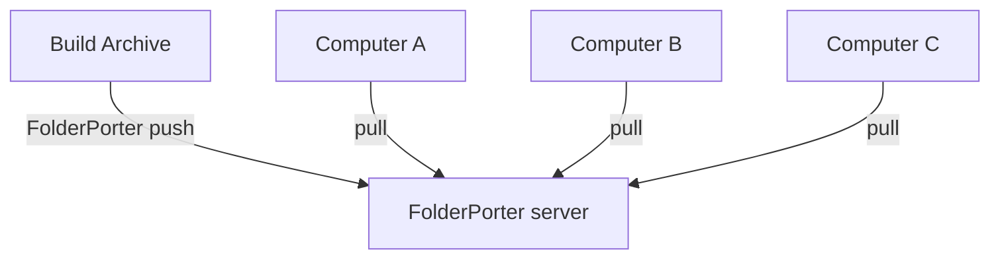

[English](./README.md)|[简体中文](./README-zh.md)

- Folder movers synchronize folders between multiple computers, transferring data differentially.
- If the current system is Linux, set the folder and file permissions to 775 (rwxrwxr-x)
- Runtime environment: .net 8
- Connection method: TCP

[TOC]
- [Support](#support)
- [Windows Install](#windows-install)
  - [Windows Edit OS Path](#windows-edit-os-path)
- [Linux Install](#linux-install)
  - [Environment](#environment)
  - [Copy App Files](#copy-app-files)
  - [Add Linux Service](#add-linux-service)
  - [Linux Add Soft Link](#linux-add-soft-link)
- [update AppSettings.json](#update-appsettingsjson)
  - [Configuration that needs to be set](#configuration-that-needs-to-be-set)
  - [Default parameters, can be used without adjustment.](#default-parameters-can-be-used-without-adjustment)
  - [AppSettings.json Template](#appsettingsjson-template)
- [How to Push](#how-to-push)
- [How to Pull](#how-to-pull)
- [Cluster Deployment](#cluster-deployment)

# Support
|                                                                   | Windows x86 | Windows x86-64 | Windows arm64 | Linux arm64 | Linux x86-64 | MacOS x86-64 | MacOS M1 |
| ----------------------------------------------------------------- | ----------- | -------------- | ------------- | ----------- | ------------ | ------------ | -------- |
| [Release](https://github.com/ZhangHuan0407/FolderPorter/releases) | ❌           | ✅              | ❌             | ✅           | ✅            | ❌            | ❌        |
| Source code installation                                          | ❌           | ✅              | ❓             | ✅           | ✅            | ❓            | ❓        |
- ✅: yes
- ❓: Theory supports it, but it has not been tested.
- ❌: no

# Windows Install
- unzip [downloaded](https://github.com/ZhangHuan0407/FolderPorter/releases)
```
FolderPorter.exe server
```
- It may run normally, or it may require you to install .net 8 yourself.

- And then, [update AppSettings.json](#update-appsettingsjson)

## Windows Edit OS Path
- Edit OS Path
- Add the folder of your FolderPorter.exe


- Open cmd and enter FinderPorter
- Starting the FinderPorter process is considered a success

# Linux Install
## Environment
- First, [install dotnet 8](https://learn.microsoft.com/zh-cn/dotnet/core/install/linux-ubuntu-install)
```
sudo apt install dotnet-runtime-8.0
```

## Copy App Files
- Second, unzip [downloaded](https://github.com/ZhangHuan0407/FolderPorter/releases) zip file and move it to /lib/FolderPorter
```
cd /var
wget -O /var/FolderPorter.zip download-url-here
unzip FolderPorter.zip -d FolderPorter
cd /lib
mkdir FolderPorter
mv /var/FolderPorter/Linux-*/* /lib/FolderPorter/
cp /lib/FolderPorter/AppSettingsTemplate.json /lib/FolderPorter/AppSettings.json
chmod +x /lib/FolderPorter
chmod +x /lib/FolderPorter/FolderPorter
chmod +r /lib/FolderPorter/*
ls -al FolderPorter/
# drwxrwxrwx   2 root         root           4096 May 10 14:32 .
# -rwxr-xr-x   1 root         root         123942 May 10 14:32 FolderPorter
# -rw-r--r--   1 root         root            431 May 10 13:19 AppSettings.json
# hide other files
```

- And then, [update AppSettings.json](#update-appsettingsjson)

## Add Linux Service
- Optional, use systemd to launch FolderPorter server
- sudo nano /etc/systemd/system/FolderPorter.service
- add content:
```
[Unit]
Description=FolderPorter server :17979 /lib/FolderPorter
After=network.target

[Service]
WorkingDirectory=/lib/FolderPorter
ExecStart=/lib/FolderPorter/FolderPorter server

# Please note that the process is set to automatically restart if it crashes.
Restart=on-failure
RestartSec=120

KillSignal=SIGINT

# It is better not to set the root user, otherwise the owner of the files created will be the root user.
User=folderporter

[Install]
WantedBy=multi-user.target
```
- Use systemctl to control the starting and stopping of the server.
```
systemctl enable FolderPorter.service
systemctl disable FolderPorter.service
systemctl status FolderPorter.service
systemctl restart FolderPorter.service
# If Restart=on-failure is set, remember to disable it before stopping.
systemctl stop FolderPorter.service
```

## Linux Add Soft Link
```
sudo ln -s /lib/FolderPorter/FolderPorter /bin/FolderPorter
```

# update AppSettings.json
## Configuration that needs to be set
- Password is the password for the applications running on the current drive. Limit: 1000
- LocalFolders lists all bound folders, with the key being the folder name.
  - RootPath is the disk path of this folder, using / for both Windows and Linux; otherwise, there may be execution errors.
  - CanWrite indicates whether this folder accepts Push from remote devices (or Pull locally).
  - CanRead indicates whether this folder accepts Pull from remote devices (or Push locally).
- RemoteDevice lists all accessible remote devices, with the key being the remote device name.
  - IP is the IP + port that the remote device listens to in server mode.
  - DevicePassword is the Password from the remote device's AppSettings.json.

## Default parameters, can be used without adjustment.
- MaxWorkerThreadCount: The upper limit of the calculation thread count for the thread pool
- MaxIOThreadCount: The upper limit of the IO thread count for the thread pool
- RemoteBuzyRetrySeconds: Delay this time before retrying when the remote device is busy
- ConnectTimeoutSeconds: Connection timeout duration

## AppSettings.json Template
```
{
  "Password": "c7ce0d8e-4985-4464-9146-0767be889a45",
  "LocalFolders": {
    "RegexGameWebGL": {
      "RootPath": "D:/RegexGame/Builds/WebGL Github/RegexGame",
      "CanWrite": true,
      "CanRead": true
    },
    "TestFolder": {
      "RootPath": "/var/TestFolder",
      "CanWrite": true,
      "CanRead": true
    }
  },
  "RemoteDevice": {
    "raspberry": {
      "IP": "192.168.1.3:17979",
      "DevicePassword": "d0d642fb-b77d-4e32-b77d-2444cd8788c3"
    }
  },

  "MaxWorkerThreadCount": 2,
  "MaxIOThreadCount": 3,

  "RemoteBuzyRetrySeconds": 5,
  "ConnectTimeoutSeconds": 30,

  "ListernPort": 17979
}
```

# How to Push
- Assuming that 192.168.1.2 needs to transfer files to 192.168.1.1

- PC 192.168.1.1 AppSettings.json
```
{
  "Password": "123",
  "LocalFolders": {
    "TestFolder": {
      "RootPath": "/var/TestFolder",
      "CanRead": true,
      "CanWrite": true
    }
  }
  "ListernPort": 17979,
  ...
}
```

- PC 192.168.1.2 AppSettings.json
```
{
  "LocalFolders": {
    "TestFolder": {
      "RootPath": "d:/TestFolder",
      "CanRead": true,
      "CanWrite": true
    }
  }
  "RemoteDevice": {
    "PC_1": {
      "IP": "192.168.1.1:17979",
      "DevicePassword": "123"
    }
  },
  ...
}
```

- PC 192.168.1.1
```
FolderPorter server
```

- PC 192.168.1.2
```
FolderPorter push@PC_1:TestFolder
```
- At this time, 192.168.1.2 will push its d:/TestFolder folder to 192.168.1.1 /var/TestFolder folder
- 192.168.1.1 will first write the differences and then remove the extra files.

# How to Pull
- In the [configuration](#how-to-push), you can use the following command to reverse the synchronization direction:
- PC 192.168.1.2
```
FolderPorter pull@PC_1:TestFolder
```
- At this point, 192.168.1.1 will push its /var/TestFolder folder to 192.168.1.2 d:/TestFolder folder.
- 192.168.1.2 will first write the differences, and then remove the extra files.

- If there is a general artifact transfer direction, such as a packaging machine that only produces and does not require read-back,
- you can modify the configuration of this packaging machine, CanWrite: false, to ensure that writing is always unsuccessful.

# Cluster Deployment

- To avoid errors caused by multi-threaded file operations
- Currently, Computers A, B, and C cannot operate in parallel and will automatically queue to wait.